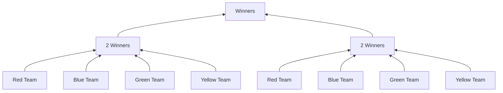

# Teams

#  
# Shops

| Category Name | Block List|  
| ------------- |---------- |  
| Sea Blocks    | SPONGE, PRISMARINE, PRISMARINE_BRICKS, DARK_PRISMARINE, SEAL_LANTERN, PRISMARINE_STAIRS, PRISMARINE_BRICKS_STAIRS, DARK_PRISMARINE_STAIRS, PRISMARINE_SLAB, PRISMARINE_BRICKS_SLAB, DARK_PRISMARINE_SLAB |  
| End Blocks | PURPUR_BLOCK, PURPUR PILLAR, END_STONE, END_STONE_BRICKS, PURPUR_STAIRS, END_STONE_BRICK_STAIRS, PURPUR_SLAB, END_STONE_BRICK_SLAB |  
| Nether Blocks | CHISELED_QUARTZ_BLOCK, BLOCK_OF_QUARTZ, QUARTZ_BRICK, QUARTZ_PILLAR, QUARTZ_STAIRS, QUARTZ_SLAB |
|Earth Blocks| WHITE_CONCRETE, LIGHT_GRAY_CONCRETE, GRAY_CONCRETE, ORANGE_CONCRETE, MAGENTA_CONCRETE, LIGHT_BLUE_CONCRETE, YELLOW_CONCRETE, PINK_CONCRETE, PURPLE_CONCRETE, CYAN_CONCRETE, BLUE_CONCRETE, BROWN_CONCRETE, GREEN_CONCRETE, RED_CONCRETE, BLACK_CONCRETE, WHITE_TERRACOTTA, LIGHT_GRAY_TERRACOTTA, GRAY_TERRACOTTA, ORANGE_TERRACOTTA, MAGENTA_TERRACOTTA, LIGHT_BLUE_TERRACOTTA, YELLOW_TERRACOTTA, PINK_TERRACOTTA, PURPLE_TERRACOTTA, CYAN_TERRACOTTA, BLUE_TERRACOTTA, BROWN_TERRACOTTA, GREEN_TERRACOTTA, RED_TERRACOTTA, BLACK_TERRACOTTA, WHITE_GLAZED_TERRACOTTA, LIGHT_GRAY_GLAZED_TERRACOTTA, GRAY_GLAZED_TERRACOTTA, ORANGE_GLAZED_TERRACOTTA, MAGENTA_GLAZED_TERRACOTTA, LIGHT_BLUE_GLAZED_TERRACOTTA, YELLOW_GLAZED_TERRACOTTA, PINK_GLAZED_TERRACOTTA, PURPLE_GLAZED_TERRACOTTA, CYAN_GLAZED_TERRACOTTA, BLUE_GLAZED_TERRACOTTA, BROWN_GLAZED_TERRACOTTA, GREEN_GLAZED_TERRACOTTA, RED_GLAZED_TERRACOTTA, BLACK_GLAZED_TERRACOTTA,|