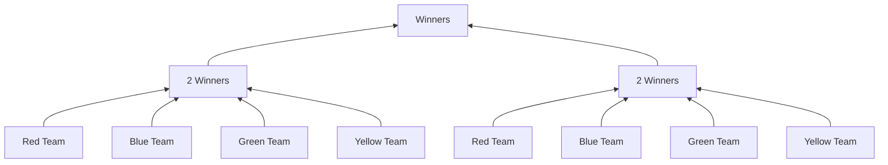

# Teams

#  
# Shops

| Category Name | Block List|  
| ------------- |---------- |  
| Sea Blocks    | SPONGE, PRISMARINE, PRISMARINE_BRICKS, DARK_PRISMARINE, SEAL_LANTERN, PRISMARINE_STAIRS, PRISMARINE_BRICKS_STAIRS, DARK_PRISMARINE_STAIRS, PRISMARINE_SLAB, PRISMARINE_BRICKS_SLAB, DARK_PRISMARINE_SLAB |  
| End Blocks | PURPUR_BLOCK, PURPUR PILLAR, END_STONE, END_STONE_BRICKS, PURPUR_STAIRS, END_STONE_BRICK_STAIRS, PURPUR_SLAB, END_STONE_BRICK_SLAB |  
| Nether Blocks | CHISELED_QUARTZ_BLOCK, BLOCK_OF_QUARTZ, QUARTZ_BRICK, QUARTZ_PILLAR, QUARTZ_STAIRS, QUARTZ_SLAB |
|Earth Blocks| WHITE_CONCRETE, LIGHT_GRAY_CONCRETE, GRAY_CONCRETE, ORANGE_CONCRETE, MAGENTA_CONCRETE, LIGHT_BLUE_CONCRETE, YELLOW_CONCRETE, PINK_CONCRETE, PURPLE_CONCRETE, CYAN_CONCRETE, BLUE_CONCRETE, BROWN_CONCRETE, GREEN_CONCRETE, RED_CONCRETE, BLACK_CONCRETE, WHITE_TERRACOTTA, LIGHT_GRAY_TERRACOTTA, GRAY_TERRACOTTA, ORANGE_TERRACOTTA, MAGENTA_TERRACOTTA, LIGHT_BLUE_TERRACOTTA, YELLOW_TERRACOTTA, PINK_TERRACOTTA, PURPLE_TERRACOTTA, CYAN_TERRACOTTA, BLUE_TERRACOTTA, BROWN_TERRACOTTA, GREEN_TERRACOTTA, RED_TERRACOTTA, BLACK_TERRACOTTA, WHITE_GLAZED_TERRACOTTA, LIGHT_GRAY_GLAZED_TERRACOTTA, GRAY_GLAZED_TERRACOTTA, ORANGE_GLAZED_TERRACOTTA, MAGENTA_GLAZED_TERRACOTTA, LIGHT_BLUE_GLAZED_TERRACOTTA, YELLOW_GLAZED_TERRACOTTA, PINK_GLAZED_TERRACOTTA, PURPLE_GLAZED_TERRACOTTA, CYAN_GLAZED_TERRACOTTA, BLUE_GLAZED_TERRACOTTA, BROWN_GLAZED_TERRACOTTA, GREEN_GLAZED_TERRACOTTA, RED_GLAZED_TERRACOTTA, BLACK_GLAZED_TERRACOTTA,|

# Weapon Tiers
| Tiers Name     | Item List |
| -------------- | --------- |
| **Tier C**         | Stone Tools, Iron Tools, Iron Armor, Leather Armor |
| **Tier B** | Gold Tools, Gold Armor, Bow|
| **Tier A** | Diamond Tools, Diamond Armor, Crossbow |
|**Tier S**| Netherite Tools, Netherite Armor|
| **Tier S+** | Darsa Super Item |

Note :
 - Jika sebuah item di enchant, maka level tier akan meningkat satu tier

# Darsa Items

|Item Name| Item Type| Ability | Description |
|---------|----------|-------- |------------ |
|Frost Sword| DIAMOND_SWORD| <ul> <li> Stun Enemy : 2 Seconds</li><li> Ice Domain : Mengubah sekeliling menjadi es</li> </ul>| The mystical sword once wielded by the Ice Lord |
|Fiery Sword| NETHERITE_SWORD | <ul><li>Burn Enemy : 10 Seconds</li>Fire Domain : Mengubah sekeliling menjadi api<li></li></ul>| The mystical sword once wielded by the Fire Lord |
|Light Boots|  GOLD_BOOTS| <ul> <li> Increase Speed : 2x </li> </ul>| The Legendary shoes once worn by the Fastest Knight, Knight of Light!! |
|Ancient Ball|  HEART_OF_THE_SEA | <ul><li>Heal Player Team</li></ul>| The ball that can heal your team. | 
|Shadow Cape|  LEATHER_CHESTPLATE | <ul><li>Make Player Invisible</li></ul>| The mantle of the greatest assassin with the ability to Hide himself in the shadows |
| Undead Resurrection| WITHER_SKELETON_SKULL | <ul><li>Resurrect 8 Undead </li></ul>| An item that can resurrect the undead. The power of a Necromancer King.|
